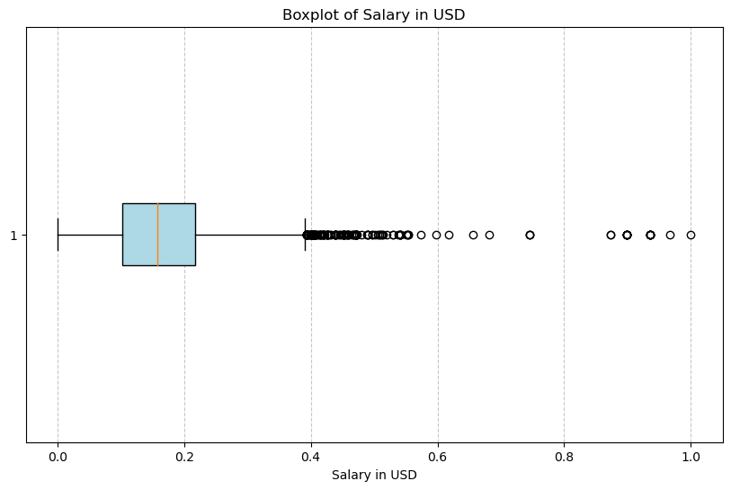
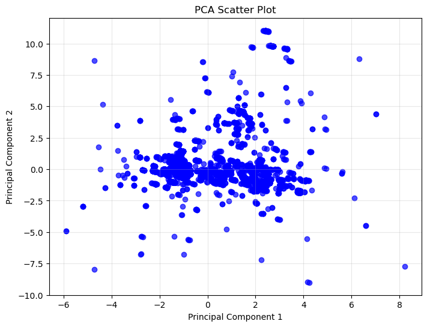

# Preprocessing & Feature Engineering

---

## High Level Overview
---

### Preprocessing Steps

1. **Library Imports:**  
   - Essential libraries for preprocessing and analysis were loaded:  
     - `pandas` for data manipulation  
     - `scikit-learn` for scaling and train-test split  
     - `matplotlib` for visualizations  

2. **Data Preparation:**  
   - The dataset `Data_Science_Salaries.csv` was imported.  
   - Duplicate rows were removed to ensure data integrity.  
   - Outliers were identified and filtered using IQR.  
   - Continuous variables were normalized to a 0-1 range using Min-Max scaling.  

3. **Dataset Output:**  
   - Preprocessed data was saved as `Preprocessed_Data.csv`.  

---

### Feature Engineering Steps

1. **Reload Preprocessed Data:**  
   - The preprocessed dataset was reloaded for feature engineering.  

2. **Feature Creation:**  
   - Created a new column, `experience_job_combination`, combining `experience_level` and `job_title`.  
   - One-hot encoding was applied to categorical features to convert them into machine-readable formats.  

3. **Dataset Output:**  
   - Feature-engineered data was saved as `Feature_Engineered_Data.csv`.  

---

### Summary Statistics and PCA

1. **Descriptive Statistics:**  
   - Summary statistics were computed for numerical variables.  
   - Key metrics like mean, standard deviation, and min/max values were included.  

2. **Boxplot:**  
   - A boxplot of `salary_in_usd` was created to analyze salary distribution.  

3. **Principal Component Analysis:**  
   - Dimensionality reduction was applied using PCA, reducing features to two principal components.  
   - A scatter plot visualized the PCA results.  

## Preprocessing & Feature Engineering
---
### Recap Background & Question 
---
Research Question: In what ways do experience level, job title, company size, remote work ratio, and geographic location influence salary trends in the data science field?  
Hypothesis: Experience level and job title are the most influential factors in determining salary.  
Prediction: Remote work flexibility, larger company size, and geographic location are positively linked to higher salaries.  

### Methods 
---

The initial plan for preprocessing included handling missing values, removing duplicates, and confirming all salary data was standardized to USD. For feature engineering, I planned to encode categorical variables like experience level and job title and normalize continuous variables such as salary and remote work ratio. I also planned to create new features combining experience level and job title to better understand their impact on salary. Following the EDA last week, I found outliers in the salary data that need handling to avoid skewing results. I also found that experience level and job title strongly influence salaries, so I plan to improve these variables by pairing similar groups and analyzing their effects. These findings  
have revamped the approach to focus more on these key factors during feature engineering. To preprocess the dataset, I began by checking for and handling missing values to ensure a complete and accurate analysis. Since the dataset was already well organized, with no missing entries, this step required minimal changes. I removed duplicate rows to avoid repeated information that could bias my analysis. Additionally, I confirmed that all salary data was standardized to USD to ensure consistent comparisons across geographic locations. Outliers in the salary data were identified using IQR analysis and marked for review, as they could represent legitimate high paying roles. Categorical variables like experience level and  
job title were one hot encoded for machine learning. Continuous variables, such as salary in usd and remote ratio, were normalized to reduce the impact of extreme values. These steps guarantee data integrity and consistency for modeling.  
For feature engineering, I focused on creating meaningful features to increase the predictive power of the dataset. First, I introduced an interaction feature, experience job combination, by combining experience level and job title. This new feature was designed to capture the influence of these variables on salary trends, as identified during EDA. By including this feature, I focused on uncovering relationships that could explain salary patterns, specifically the dynamic between job roles and experience levels. Next, I used one hot encoding for categorical variables, including experience level, job title, and the recently created experience job combination. This transformation converted non numeric data into a format that works effectively with machine learning algorithms while keeping the information from each category. To reduce multicollinearity, I used the drop first option to exclude the first category of each encoded variable. These methods were chosen to  
maintain the dataset’s clarity and prepare it for advanced modeling, making sure all relevant information was included.  

### Results (Tables, Visualizations, and Brief Interpretations) 
---

Justifications for Cleaning, Collapsing of Variables, Encoding, or Mathematical Transformation Steps To create a clean and reliable dataset for analysis, duplicates were removed to prevent repeating the same data points, which could skew statistical measures and bias machine learning models. This step confirmed the dataset accurately represented unique observations, improving data integrity. Outliers in salary in usd were identified using the IQR method. Although these extreme values fell outside the typical salary range, they were retained as they represent legitimate high paying roles that are central to the research question. A box plot visualization of salary in usd revealed these outliers, supporting the decision to keep them for further analysis (see Figure 1). One hot encoding was applied to categorical variables, including experience level, job title, and the newly created feature experience job combination. This transformation converted these non numeric variables into a format compatible with machine learning. The drop first option was used to avoid multicollinearity by leaving out the first category of each variable. This method guaranteed that the categorical variables were represented correctly without indicating any order or adding unnecessary duplication Normalization was applied to continuous variables using MinMaxScaler. This process adjusted all values to a range between 0 and 1, reducing the impact of varying numerical ranges  
and making sure all features contributed equally to model performance. After feature engineering, StandardScaler was applied to standardize the data by centering features at 0 and scaling variance to 1. This standardization step was vital for unsupervised methods such as PCA, as they depend on consistent feature magnitudes. 

#### Figure 1: Boxplot of Salary in USD

  
### Preprocessing Steps 
---
Preprocessing included splitting the dataset into training and testing sets to prepare it for machine learning. An 80/20 split was used to balance the need for ample training data with a reliable testing set for validation. This split ensures that the model can perform well on new data, a critical aspect of evaluating model performance. A random state was set to guarantee reproducibility, allowing consistent results across multiple runs. The dataset was inspected for missing values, but none were identified, removing the need for replacement. Continuous variables were adjusted to improve compatibility with machine learning algorithms. For categorical variables, one hot encoding confirmed that they were represented numerically while retaining information from each category. After these preprocessing steps, summary statistics and visualizations were generated to verify the changes. For example, the distribution of salary in usd before and after scaling was analyzed to confirm that normalization effectively minimized range differences while maintaining the overall structure of the data.   

### Unsupervised Methods 
---
For feature engineering, I used PCA to identify patterns and reduce the number of dimensions. PCA was performed on the feature engineered dataset after scaling with StandardScaler, guaranteeing all features had a mean of 0 and a standard deviation of 1. The first two principal components explained roughly 1% of the total variance, showing that most of the variability in the dataset was not captured well by these components. The PCA scatter plot revealed limited separation between data points, reinforcing the conclusion that PCA did not add significant value for reducing dimensions or extracting feature insights. Based on these results, PCA was not used in the next steps of this analysis. Although PCA is often useful for datasets with multiple dimensions, the low explained variance in the dataset suggests that the essential variability is already captured by the existing features, eliminating the need for dimensionality reduction. If other unsupervised methods, such as k-means clustering or LDA, were excluded, it was because they were not relevant to the structure of the data. 

#### Figure 2: PCA Scatter Plot

### Plan for Supervised Methods 
---

In future steps, supervised methods will be used to evaluate feature importance and improve the dataset for predictive modeling. Random Forest will be applied to rank features by their importance in predicting salary in usd. This method handles both categorical and continuous variables effectively, making it an ideal choice for the dataset. The results from Random Forest will help identify the most predictive features, such as experience level, job title, and remote ratio. Additionally, Lasso Regression will be used to eliminate irrelevant features, reducing the complexity of the dataset. Lasso's ability to penalize less important variables helps create a clear and reliable model that is less prone to overfitting. Recursive Feature Elimination will also be explored to update the feature set, improving the model’s accuracy and efficiency. These supervised methods will complement the unsupervised PCA analysis by focusing on feature selection and improvement, providing a strong foundation for predictive modeling. This approach will offer a clearer understanding of the main factors influencing salary trends in data science roles.  
### Discussion & Next Steps 
---
#### Discussion:  
--- 
The exploratory and feature engineering process revealed key insights into salary trends within data science roles. The analysis confirmed that experience level and job title are the most significant factors influencing salaries, consistent with the hypothesis. The creation of the experience job combination feature successfully captured the impact of these variables, improving my understanding of their relationship to salary outcomes. Keeping outliers in salary in usd allowed us to preserve critical insights into high paying roles, which are vital to addressing the research question: How do key factors such as experience level, job title, company size, remote work ratio, and geographic location influence salaries in the data science field? The PCA scatter plot showed that reducing dimensions did not provide meaningful results due to the low variance explained, supporting its removal from further analysis. These findings strengthen my understanding of the data and reinforce the decision to focus on supervised methods for additional improvement. While the initial hypothesis remains valid, some adjustments were necessary. PCA did not add significant value, as the existing features already captured most of the dataset’s  
variability, showing that specific features are more important than feature reduction methods. Similarly, methods like k-means clustering were not used because the focus was on regression, not grouping data. These choices were supported by the PCA scatter plot and summaries of key features.  
#### Next Steps:  
---
In the next phase, I will implement supervised machine learning models to predict salaries and measure the impact of key features. Random Forest will be used to determine feature importance, prioritizing the most influential variables, such as experience level and job title. This method will enable us to confirm and improve my feature set while handling complex relationships and interactions in the data. Additionally, Lasso Regression will be applied to reduce multicollinearity and eliminate irrelevant features, simplifying the model while maintaining predictive accuracy. I will use Recursive Feature Elimination to improve the feature set by removing less significant predictors. The final models will include linear regression as a baseline for comparison and more complex models such as gradient boosting or neural networks to capture non linear relationships. These steps will ensure that the analysis is reliable, interpretable, and capable of answering th research question with precision. The results will provide actionable insights into how key factors drive salary trends in data science roles. 
